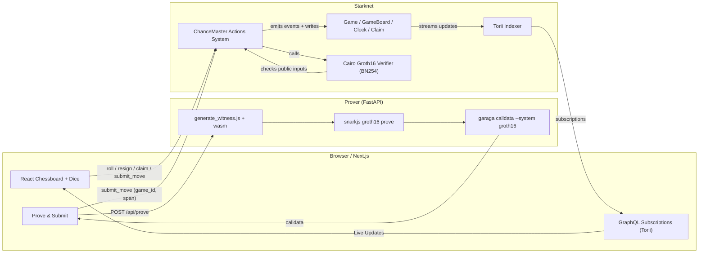

# Chance-Master ♟️🎲

**Fully on-chain, zk-verifiable Dice Chess on Starknet**

Chance-Master is a multiplayer dice-chess variant where **every legal move is proven off-chain (Groth16)** and **verified on-chain** before state updates. No one can cheat: the contract cross-checks the board, turn, dice, and move result against the proof and only then commits the next position.

---

## Highlights

* **ZK-enforced legality**: Circom circuits + snarkjs produce Groth16 proofs; Cairo verifier checks them on Starknet before writing state.
* **Real-time multi-play**: WebSocket subscriptions (Torii) keep both players instantly in sync.
* **Sign-less UX**: Gameplay uses a permissive account/policy flow so you don’t manually sign each action during a match.
* **Dojo ECS**: Game data lives in Dojo models (Game, GameBoard, GameClock, GameClaim, etc.) for clean, queryable state.
* **Verifiable dice**: Contract emits a roll; UI encodes dice as the circuit expects and includes them in the proof.

> Key building blocks referenced in this repo: react-chessboard (UI), python-chess (state plumbing), snarkjs (Groth16), Starknet.js (RPC/Account), Dojo/Torii (world + live queries), Garaga (proof calldata for BN254). See references at the end.

---

## Monorepo layout

```
.
├── apps
│   ├── prover/               # FastAPI service: builds witness, proves, emits calldata
│   └── web/                  # Next.js app: board, dice, rolls, subscriptions, UX
├── packages
│   ├── circuits/             # Circom circuits + compiled artifacts (wasm/zkey/vk)
│   ├── contracts-dojo/       # Cairo systems/models (Dojo world)
│   └── verifier/             # Cairo Groth16 verifier (BN254/Garaga-compatible)
├── docker-compose.yml        # One-command dev stack (web + prover)
└── pnpm-workspace.yaml
```

---

## Architecture


### Gameplay flow

1. **Roll** on-chain → contract stores `prev_roll`.
2. **Pick a move** in UI → client POSTs `{fen, move, dice}` to `/api/prove`.
3. **Prover** builds witness, generates Groth16 proof, runs **Garaga** to produce Starknet-ready calldata.
4. **Client** sends `submit_move(game_id, Span<felt>)`.
5. **Contract** verifies: board bitboards, turn, dice, castling/EP metadata, and expected next board. If valid → writes new state, flips turn, resets `prev_roll`.

---

## 🔧 Prerequisites

* Node 18+ and **pnpm** (recommended) or npm
* Docker + Docker Compose (to run prover + web)
* Starknet Sepolia RPC (the defaults use public endpoints)
* Circuits artifacts present in `packages/circuits/build`:

  * `Main_js/Main.wasm`, `Main_js/generate_witness.js`
  * `Main_0000.zkey`
  * `verification_key.json`

---

## Quick start (Docker)

```bash

# from repo root

docker compose up --build
```

This brings up:

* **apps/prover** at [http://localhost:8000](http://localhost:8000)
* **apps/web** at [http://localhost:3000](http://localhost:3000)
* **torii** at [http://localhost:8080](http://localhost:8080)
* **circuits/build**

## Proving API (apps/prover)

- Job: Generate a Valid proof calldata to be used for `submit_move` function in the world contract.
- Inputs: `FEN` structure of the Board, Move Played, Dice Rolled 

## Web app (apps/web)

* Next.js + `react-chessboard` UI
* Subscriptions via Torii GraphQL → instant board/clock updates for both players
* On Make Move:

  1. POST to `/api/prove` with `{ fen, move, dice }`
  2. If `calldata` returned → optimistic local update + **submit_move** on chain

---

## Contracts (packages/contracts-dojo)

* **Systems**: `actions.cairo` exposes:

  * `enqueue / dequeue`
  * `roll`
  * `submit_move(game_id, Span<felt>)` (verifies proof then writes next board)
  * `resign`, `offer_draw`, `claim / accept_claim / adjudicate_claim`
  * `flag_win` (declare win on time)
* **Models**: Game, GameBoard, GameClock, GameClaim, GlobalVars, Player
* **Verifier**: Cairo BN254 Groth16 verifier (Garaga-compatible calldata)

---

## Security & correctness notes

* The on-chain system **never trusts the client**: it verifies

  * mover color & turn
  * dice (previous roll) equality
  * castling rights & EP fields
  * exact bitboards before/after
  * opponent-in-check flag for eventing/UI
* A mismatched field → **revert** (e.g., “Fraudulent Proof”). Client error messages and server logs include extra breadcrumbs to debug quickly.
